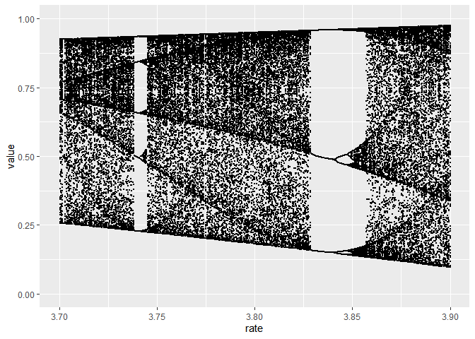

<!-- README.md is generated from README.Rmd. Please edit that file -->

# chaos

Attempting to recreate some of the views I found in this interesting
article:

[Geoff Boeing - Chaos Theory and the Logistic
Map](https://geoffboeing.com/2015/03/chaos-theory-logistic-map)

## System Behavior and Attractors

As with most things, the tidyverse will make this easier to read and
more elegant to code

``` r
library(tidyverse)
```

Define the logistic map

``` r
f <- function(x0, r) r*x0*(1-x0)
```

Define a function that iterates the logistic map for a specified number
of generations

``` r
f2 <- function(x0, r, g = 10){
  
  out <- vector(mode="double", length = g)
  
  out[1] <- x0
  
  for(i in 2:g){
    o <- f(x0=x0, r=r)
    x0 <- o
    out[i] <- o
  }
  
  out
}
```

Visualise the attractors for different growth rates

``` r
map2_dfr(seq(0.5, 3.5, by=0.5), 20, 
         ~tibble(rate=as.character(.x),
                 value=f2(r=.x, x0=0.5, g=.y),
                 gen=1:.y)) %>% 
  ggplot(aes(gen, value, col=rate)) + 
  geom_line()+
  labs(title="Logistic model results for different growth rates",
       x = "Generation",
       y = "Population",
       col = "Growth rate")
```

<!-- -->

## Bifurcations and the Path to Chaos

Repeat the experiment above but for 10000 growth rates from 0 - 4 with
each experiment lasting 200 generations

``` r
bi_data <- 
  map2_dfr(seq(0, 4, length.out = 10000), 200, 
           ~tibble(rate = .x,
                   value = f2(r=.x, x0=0.5, g=.y),
                   gen = 1:.y))
```

Throw away the first 100 rows per experiment and visualise the unique
attractors

``` r
bi_data_attractors <- 
  bi_data %>% 
  group_by(rate) %>%
  filter(row_number() > 100) %>% 
  distinct(rate, value)

bi_data_attractors %>% 
  ggplot(aes(rate, value))+
  geom_point(size=0.1)
```

<!-- -->

Zoom in

``` r
last_plot() + scale_x_continuous(limits = c(2.8, 4))
#> Warning: Removed 311176 rows containing missing values (geom_point).
```

<!-- -->

``` r
last_plot() + scale_x_continuous(limits = c(3.7, 3.9))
#> Warning: Removed 476526 rows containing missing values (geom_point).
```

<!-- -->
